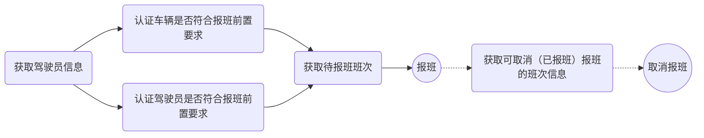
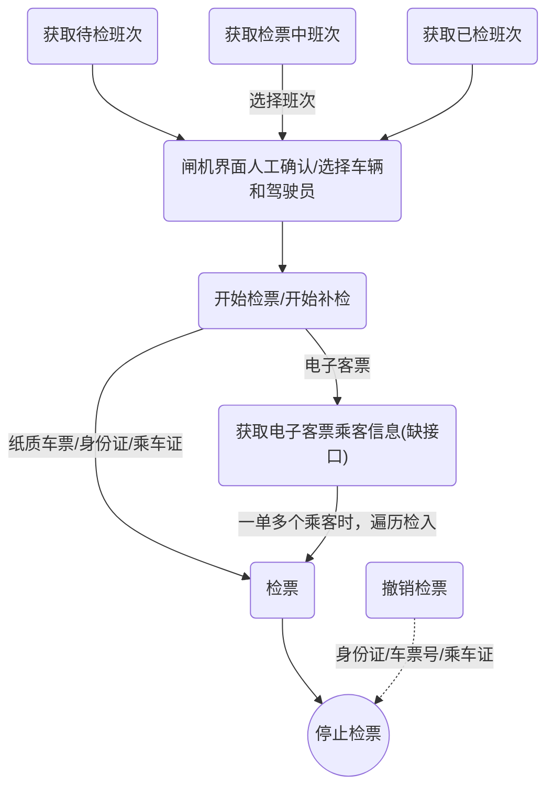

# <center>客运站门检闸机及自助报班机接口文档</center>

<!-- @import "[TOC]" {cmd="toc" depthFrom=2 depthTo=3 orderedList=false} -->

<!-- code_chunk_output -->

- [调试说明](#调试说明)
  - [准备](#准备)
  - [接口调试说明](#接口调试说明)
  - [返回码说明](#返回码说明)
- [接口文档](#接口文档)
  - [登录](#登录)
  - [获取待检班次](#获取待检班次)
  - [获取检票中班次](#获取检票中班次)
  - [获取已检票班次](#获取已检票班次)
  - [获取班次座位](#获取班次座位)
  - [认证安全门检符合检票前置要求](#认证安全门检符合检票前置要求)
  - [开始检票](#开始检票)
  - [开始补检](#开始补检)
  - [停止检票](#停止检票)
  - [更换车辆](#更换车辆)
  - [获取电子客票乘客信息](#获取电子客票乘客信息)
  - [检票](#检票)
  - [撤销检票](#撤销检票)
  - [获取车辆信息](#获取车辆信息)
  - [获取驾驶员信息](#获取驾驶员信息)
  - [获取待报班班次](#获取待报班班次)
  - [认证车辆是否符合报班前置要求](#认证车辆是否符合报班前置要求)
  - [认证驾驶员是否符合报班前置要求](#认证驾驶员是否符合报班前置要求)
  - [报班](#报班)
  - [获取可取消（已报班）报班的班次信息](#获取可取消已报班报班的班次信息)
  - [取消报班](#取消报班)

<!-- /code_chunk_output -->


## 调试说明
### 准备
1. 在客运系统中，为每个闸机、报班机建立独立用户，方便区分日志，排查问题。
2. 每个闸机、报班机配置【上车站id】，须和客运系统中的上车站id保持一致。
3. 每个闸机配置【检票口id】，须和客运系统中的检票口id保持一致。
4. 每个闸机配置【发票代码】，主要用于在跨年时对重复车票号进行区分。需在更换在启用新的发票代码时更新配置（一般一年一次）。
5. 上述配置是部分接口调用的必填参数，闸机、报班机须提供相关的修改界面。
6. 报班前，车辆须过车况例检，参见[报班准备](#报班准备)。
7. 检票可用纸质票号、身份证、乘车证，需提前在测试环境购买、配置，参见[购票准备](#购票准备)。

> 以下准备工作操作中如遇问题，可联系我方进行远程协助指导

#### 购票准备
本节对，[准备](#准备)小节中的第7点做简单说明，以方便准备购票数据，[实名制购票](#实名制购票)用于准备纸质票和身份证检票数据，[乘车证配置](#乘车证配置)用于准备可检入的乘车证

##### 实名制购车票
1. 使用我方提供的安装包，完成测试环境用的ERP系统客户端软件安装。
2. 桌面系统快捷方式目录`综合业务信息服务平台`中，点击`客运数据库连接配置`，配置客运子系统SQL Server数据库连接配置。
```
服务器IP：115.239.233.230,2544
数据库名：kyfjkg
连接帐户：test_fj
密码：test_fj
```
3. 用以下帐号登录班车调度，主菜单`车次管理`->`生成运行环境`中生成售票用的车次环境，如该天班次环境已生成，可略过此步。
```
帐号：zyw，密码：123
```
4. 用以下帐号登录售票台，购票需要检入班次的车票，如出售前没有弹出输入身份证信息窗口，需要进行第5步操作。实名制信息可参见[车票信息样例](#车票信息样例)
```
帐号：hzn，密码：1990
```
5. 用以下帐号登录班车调度，主菜单`线路站点`->`线路信息`中配置相关线路启用实名制。
```
帐号：zyw，密码：123
```
>注意：实名制线路购票，不能在1小时内同时购买多天或多个班次的票，可先关闭线路配置中的实名制，根据一定的规则出票后，参照以下脚本更新身份证信息。

``` sql
-- 脚本适用规则：
-- 选取一个滚动车次及一个固定车次，每个班次分别出2张票（1张全票，1张半票）
-- 可修改脚本中的源班次日期（第1天， 2020-02-03）及目标班次日期（2020-02-04），更新之后几天的数据


-- 更新表ticket_sell_lst数据 
UPDATE ticket_sell_lst 
SET id_card_no = b.id_card_no, card_type = b.card_type,
    person_name = b.person_name, sex = b.sex, person_picture = b.person_picture 
FROM
	( SELECT bus_id, ticket_type, '2020-02-04' bus_date, id_card_no, 
             card_type, person_name, sex, person_picture 
          FROM ticket_sell_lst WHERE bus_date = '2020-02-03' ) b 
WHERE
	ticket_sell_lst.bus_id = b.bus_id 
	AND ticket_sell_lst.bus_date = b.bus_date 
	AND ticket_sell_lst.ticket_type = b.ticket_type

-- 更新表agent_ticket_sale_lst数据
UPDATE agent_ticket_sale_lst 
SET id_card_no = b.id_card_no, card_type = b.card_type,
    person_name = b.person_name, sex = b.sex, person_picture = b.person_picture 
FROM
	( SELECT bus_id, ticket_type, '2020-02-04' bus_date, id_card_no, 
             card_type, person_name, sex, person_picture 
          FROM agent_ticket_sale_lst WHERE bus_date = '2020-02-03' ) b 
WHERE
	agent_ticket_sale_lst.bus_id = b.bus_id 
	AND agent_ticket_sale_lst.bus_date = b.bus_date 
	AND agent_ticket_sale_lst.ticket_type = b.ticket_type
```

###### 车票信息样例

姓名 | 身份证号 | 发票代码 | 票号 | 车次 | 线路 | 日期
- | - | - | - | - | -| -
罗建 | 513436200001131828 | 222222222222 | 00000113 | 3702 | 机场-青口榕泰  | 2020203
牛端 | 513436200001139264 | 222222222222 | 00000114 |  3702 |  机场-青口榕泰  |  2020203
卢武壮 | 513436200001134308 | 222222222222 | 00000115 | 2001 | 机场-阿波罗 |  2020203
康湖朱 | 513436200001134121 | 222222222222 | 00000116 | 2001 | 机场-阿波罗  |  2020203

##### 乘车证配置
1. 用以下帐号登录乘车证管理系统，点击系统功能菜单`乘车证`，查询出一个乘车证，详情中查看是否有相关线路授权，如没有，则进行第2步操作。
```
帐号：zyw，密码：123
100103305是一张可用的乘车证，可直接拿来用
```
2. 通过系统顶部菜单`基础信息`->`批量修改线路`，对该乘车证追加线路。

##### 购电子客票
1. 关注微信公众号`华航信航空科技有限公司`，在机场巴士中购票福州机场站出发的车票。

#### 报班准备
##### 车况例检
报班前，车辆必须先过车况例检，操作步骤如下：
1. 用以下帐号登录智能安全门检系统，点击系统功能菜单`车况门检`，查询出需要做例检的车辆。
2. 选中该车辆，点击`开始检查`按钮，如车辆还未回场，系统会提示回场。
3. 在弹出的例检详情界面中，输入本次里程表数后，点击`保存`按钮完成例检。

---

### 接口调试说明

> 接口根URL: http://101.37.71.102:7070
> 当接口响应中[返回码](#返回码说明)为40004时，即提示登录失效，需要再调用一次登录接口

#### 门检报班机业务接口调用主流程


- 报班时对驾驶员和车辆的相关证件有效期的核验，在ERP系统中根据不同类别车辆有相关匹配，因此报班机前端界面就不必自行判断是否符合，调用上图中的两个认证接口即可。

#### 检票闸机业务接口调用主流程



- 待检车次时，第一次开始检票时，调用`开始检票`接口。调用成功后转为检票中班次；停检成功后转为已检班次
- 对于检票中、已检班次需再次检票时，调用`开始补检`接口
- 对于滚动车次，因为存在多辆车报班的情况，当前班次对应那个车需要人工确认，因此闸机界面中调用开检前，无论滚动还是固定车次，最好统一再确认/选择一次车辆和驾驶员信息。
- 对某乘客注销检票后，需调用`停检`接口，以重新生成客凭数据


### 返回码说明
- 0: 成功
- 40001-49999: 接口相关错误
    - 40001-40099: 身份认证相关错误
        - 40001: 用户不存在
        - 40002: 密码错误
        - 40003: 用户已删除
        - 40004: 用户未登录，或登录已失效
    - 40101-40199: 参数相关错误
        - 40101: 缺少参数
        - 40102: 无效参数
- 50001-59999: 系统、业务相关错误
    - 50001-50099: 系统相关错误
        - 50001: 系统内部错误
        - 50002: 门检相关错误

## 接口文档
### 登录
#### URL
> /openApi.go
###### 请求方式
> GET/POST
###### 请求参数
参数 | 参数类型 | 是否必填 | 说明
- | - | - | -
method | String | 是 | 接口名称，固定为：login
username | String | 是 | 用户名，调试时可用zyw
password | String | 是 | 密码，调试时可用123
###### 请求成功返回
返回字段 | 字段类型 | 说明
- | - | - | -
code | int | 返回码，成功时固定为0
###### 请求成功返回示例
```json
{
  "code": 0
}
```
###### 请求失败返回
返回字段 | 字段类型 | 说明
- | - | - | -
code | int | 返回码，失败时为非0值
msg | String | 错误说明
error | String | 错误具体内容，若无具体内容，则不返回此字段
###### 请求失败返回示例
```json
{
    "code": 40001,
    "msg": "错误说明",
    "error": "错误具体内容"
}
```

---

### 获取待检班次
#### 说明
> 获取待检票班次。
#### URL
> /openApi.go
###### 请求方式
> GET/POST
###### 请求参数
参数 | 参数类型 | 是否必填 | 说明
- | - | - | -
method | String | 是 | 接口名称，固定为：listBusForCheck
sellStationId | String | 是 | 上车站id
busDate | String | 是 | 班次日期，格式为：yyyyMMdd
checkGateId | String | 是 | 检票口id
busId | String | 否 | 班次id（模糊查询）
###### 请求成功返回
返回字段 | 字段类型 | 说明
- | - | - | -
code | int | 返回码，成功时固定为0
data | JSONObject | 数据
&emsp; busList | JSONArray | 班次列表
&emsp;&emsp; busDate | String | 班次日期，格式为：yyyyMMdd
&emsp;&emsp; busId | String | 班次id（班次号）
&emsp;&emsp; busSerialNo | int | 班次序号，固定班次固定为0；滚动班次每天从1开始递增
&emsp;&emsp; busStartTime | String | 发车时间，格式为：HHmm
&emsp;&emsp; busKind | int | 班次类型，0：普通班次；1：滚动班次
&emsp;&emsp; checkGateId | String | 检票口id
&emsp;&emsp; endStationName | String | 终点站名称
&emsp;&emsp; license | String | 车牌号，已报班的固定班次的车牌号即为报班的车辆，滚动班次车辆号无法与报班车辆一一对应，需要人工在闸机界面进一步确认车辆、驾驶员。
&emsp;&emsp; routeName | String | 线路名称
&emsp;&emsp; isReported | int | 是否已报班，0：否；1：是

###### 请求成功返回示例
```json
{
    "data": {
        "busList": [
            {
                "busDate": "20200123",
                "busId": "3702",
                "busKind": 0,
                "busSerialNo": 0,
                "busStartTime": "0830",
                "checkGateId": "j1",
                "endStationName": "青口榕泰",
                "isReported": "1",
                "license": "闽A5A083  ",
                "routeName": "机场-青口榕泰"
            }
        ]
    },
    "code": 0
}
```
###### 请求失败返回
返回字段 | 字段类型 | 说明
- | - | - | -
code | int | 返回码，失败时为非0值
msg | String | 错误说明
error | String | 错误具体内容，若无具体内容，则不返回此字段
###### 请求失败返回示例
```json
{
    "code": 50001,
    "msg": "错误说明",
    "error": "错误具体内容"
}
```

---

### 获取检票中班次
#### 说明
> 获取待检票班次。
#### URL
> /openApi.go
###### 请求方式
> GET/POST
###### 请求参数
参数 | 参数类型 | 是否必填 | 说明
- | - | - | -
method | String | 是 | 接口名称，固定为：listCheckingBus
sellStationId | String | 是 | 上车站id
busDate | String | 是 | 班次日志，格式为：yyyyMMdd
checkGateId | String | 是 | 检票口id
###### 请求成功返回
返回字段 | 字段类型 | 说明
- | - | - | -
code | int | 返回码，成功时固定为0
data | JSONObject | 数据
&emsp; busList | JSONArray | 班次列表
&emsp;&emsp; busDate | String | 班次日期，格式为：yyyyMMdd
&emsp;&emsp; busId | String | 班次id（班次号）
&emsp;&emsp; busSerialNo | int | 班次序号，固定班次固定为0；滚动班次每天从1开始递增
&emsp;&emsp; busStartTime | String | 发车时间，格式为：HHmm
&emsp;&emsp; busKind | int | 班次类型，0：普通班次；1：滚动班次
&emsp;&emsp; ***checkGateId*** | ***String*** | ***检票口id***
&emsp;&emsp; ***endStationName*** | ***String*** | ***终点站名称***
&emsp;&emsp; license | String | 车牌号
&emsp;&emsp; routeName | String | 线路名称
&emsp;&emsp; seatQuantity | int | 座位数
&emsp;&emsp; sellQuantity | int | 售票数
&emsp;&emsp; checkQuantity | int | 检票数

###### 请求成功返回示例
```json
{
    "data": {
        "busList": [
            {
                "busDate": "20200123",
                "busId": "3702",
                "busKind": 0,
                "busSerialNo": 0,
                "busStartTime": "0830",
                "checkQuantity": 0,
                "license": "闽A5A083",
                "routeName": "机场-青口榕泰",
                "seatQuantity": 49,
                "sellQuantity": 2
            }
        ]
    },
    "code": 0
}
```
###### 请求失败返回
返回字段 | 字段类型 | 说明
- | - | - | -
code | int | 返回码，失败时为非0值
msg | String | 错误说明
error | String | 错误具体内容，若无具体内容，则不返回此字段
###### 请求失败返回示例
```json
{
    "code": 50001,
    "msg": "错误说明",
    "error": "错误具体内容"
}
```

---

### 获取已检票班次
#### 说明
> 获取待检票班次。
#### URL
> /openApi.go
###### 请求方式
> GET/POST
###### 请求参数
参数 | 参数类型 | 是否必填 | 说明
- | - | - | -
method | String | 是 | 接口名称，固定为：listCheckedBus
sellStationId | String | 是 | 上车站id
busDate | String | 是 | 班次日志，格式为：yyyyMMdd
checkGateId | String | 是 | 检票口id
###### 请求成功返回
返回字段 | 字段类型 | 说明
- | - | - | -
code | int | 返回码，成功时固定为0
data | JSONObject | 数据
&emsp; busList | JSONArray | 班次列表
&emsp;&emsp; busDate | String | 班次日期，格式为：yyyyMMdd
&emsp;&emsp; busId | String | 班次id（班次号）
&emsp;&emsp; busSerialNo | int | 班次序号，固定班次固定为0；滚动班次每天从1开始递增
&emsp;&emsp; busStartTime | String | 发车时间，格式为：HHmm
&emsp;&emsp; busKind | int | 班次类型，0：普通班次；1：滚动班次
&emsp;&emsp; ***checkGateId*** | ***String*** | ***检票口id***
&emsp;&emsp; ***endStationName*** | ***String*** | ***终点站名称***
&emsp;&emsp; license | String | 车牌号
&emsp;&emsp; routeName | String | 线路名称
&emsp;&emsp; seatQuantity | int | 座位数
&emsp;&emsp; sellQuantity | int | 售票数
&emsp;&emsp; checkQuantity | int | 检票数

###### 请求成功返回示例
```json
{
    "data": {
        "busList": [
            {
                "busDate": "20200123",
                "busId": "3702 ",
                "busKind": 0,
                "busSerialNo": 0,
                "busStartTime": "1801",
                "checkQuantity": 2,
                "license": "闽A5A083",
                "routeName": "机场-青口榕泰",
                "seatQuantity": 49,
                "sellQuantity": 2
            }
        ]
    },
    "code": 0
}
```
###### 请求失败返回
返回字段 | 字段类型 | 说明
- | - | - | -
code | int | 返回码，失败时为非0值
msg | String | 错误说明
error | String | 错误具体内容，若无具体内容，则不返回此字段
###### 请求失败返回示例
```json
{
    "code": 50001,
    "msg": "错误说明",
    "error": "错误具体内容"
}
```

---

### 获取班次座位
#### 说明
> 获取班次座位列表。仅固定车次时需要调用，滚动班次的座位列表为空。
#### URL
> /openApi.go
###### 请求方式
> GET/POST
###### 请求参数
参数 | 参数类型 | 是否必填 | 说明
- | - | - | -
method | String | 是 | 接口名称，固定为：listBusSeat
busDate | String | 是 | 班次日志，格式为：yyyyMMdd
busId | String | 是 | 班次id（班次号）
busSerialNo | int | 是 | 班次序号
checkGateId | String | 是 | 检票口id
###### 请求成功返回
返回字段 | 字段类型 | 说明
- | - | - | -
code | int | 返回码，成功时固定为0
data | JSONObject | 数据
&emsp; seatList | JSONArray | 座位列表
&emsp;&emsp; seatNo | String | 座位号
&emsp;&emsp; status | int | 座位状态，0：未知；1：未售；2：预留；3：已售；4：已检

###### 请求成功返回示例
```json
{
    "code": 0,
    "data": {
        "seatList": [
            {
                "seatNo": "01",
                "status": 3
            },
            {
                "seatNo": "02",
                "status": 4
            },
            {
                "seatNo": "03",
                "status": 2
            },
            {
                "seatNo": "04",
                "status": 1
            },
            {
                "seatNo": "05",
                "status": 1
            },
            {
                "seatNo": "06",
                "status": 1
            }
        ]
    }
}
```
###### 请求失败返回
返回字段 | 字段类型 | 说明
- | - | - | -
code | int | 返回码，失败时为非0值
msg | String | 错误说明
error | String | 错误具体内容，若无具体内容，则不返回此字段
###### 请求失败返回示例
```json
{
    "code": 50001,
    "msg": "错误说明",
    "error": "错误具体内容"
}
```

---

### 认证安全门检符合检票前置要求
> 此接口可能需要追加补充

---

### 开始检票
#### 说明
> 开始检票。
> 调用此接口前，需要调用[认证安全门检符合检票前置要求](#认证安全门检符合检票前置要求)，验证是否能开检。
#### URL
> /openApi.go
###### 请求方式
> GET/POST
###### 请求参数
参数 | 参数类型 | 是否必填 | 说明
- | - | - | -
method | String | 是 | 接口名称，固定为：startCheck
sellStationId | String | 是 | 上车站id
busDate | String | 是 | 班次日期，格式为：yyyyMMdd
busId | String | 是 | 班次id（班次号）
busKind | int | 是 | 班次类型，0：固定班次；1：滚动班次
checkGateId | String | 是 | 检票口id
license | String | 是 | 车牌号
driverId | String | 是 | 驾驶员id
driverName | String | 是 | 驾驶员名称
###### 请求成功返回
返回字段 | 字段类型 | 说明
- | - | - | -
code | int | 返回码，成功时固定为0
data | JSONObject | 数据
&emsp; busSerialNo | int | 班次序号，固定班次固定为0，滚动班次根据已发班次数递增

###### 请求成功返回示例
```json
{
    "data": {
        "busSerialNo": 0
    },
    "code": 0
}
```
###### 请求失败返回
返回字段 | 字段类型 | 说明
- | - | - | -
code | int | 返回码，失败时为非0值
msg | String | 错误说明
error | String | 错误具体内容，若无具体内容，则不返回此字段
###### 请求失败返回示例
```json
{
    "code": 50001,
    "msg": "错误说明",
    "error": "错误具体内容"
}
```

---

### 开始补检
#### 说明
> 开始补检。
#### URL
> /openApi.go
###### 请求方式
> GET/POST
###### 请求参数
参数 | 参数类型 | 是否必填 | 说明
- | - | - | -
method | String | 是 | 接口名称，固定为：startExtraCheck
busDate | String | 是 | 班次日期，格式为：yyyyMMdd
busId | String | 是 | 班次id（班次号）
busSerialNo | int | 是 | 班次序号
checkGateId | String | 是 | 检票口id
###### 请求成功返回
返回字段 | 字段类型 | 说明
- | - | - | -
code | int | 返回码，成功时固定为0

###### 请求成功返回示例
```json
{
    "code": 0
}
```
###### 请求失败返回
返回字段 | 字段类型 | 说明
- | - | - | -
code | int | 返回码，失败时为非0值
msg | String | 错误说明
error | String | 错误具体内容，若无具体内容，则不返回此字段
###### 请求失败返回示例
```json
{
    "code": 50001,
    "msg": "错误说明",
    "error": "错误具体内容"
}
```

---

### 停止检票
#### 说明
> 停止检票。
#### URL
> /openApi.go
###### 请求方式
> GET/POST
###### 请求参数
参数 | 参数类型 | 是否必填 | 说明
- | - | - | -
method | String | 是 | 接口名称，固定为：stopCheck
sellStationId | String | 是 | 上车站id
busDate | String | 是 | 班次日期，格式为：yyyyMMdd
busId | String | 是 | 班次id（班次号）
busSerialNo | int | 是 | 班次序号
checkType | int | 是 | 检票类型，1：正常检票；2：补检，对某乘客注销检票后，调用本接口时，需要通过调用[获取已检票班次](#获取已检票班次)接口来决定是否为补检
checkGateId | String | 是 | 检票口id
###### 请求成功返回
返回字段 | 字段类型 | 说明
- | - | - | -
code | int | 返回码，成功时固定为0

###### 请求成功返回示例
```json
{
    "code": 0
}
```
###### 请求失败返回
返回字段 | 字段类型 | 说明
- | - | - | -
code | int | 返回码，失败时为非0值
msg | String | 错误说明
error | String | 错误具体内容，若无具体内容，则不返回此字段
###### 请求失败返回示例
```json
{
    "code": 50001,
    "msg": "错误说明",
    "error": "错误具体内容"
}
```

---

### 更换车辆
#### 说明
> 更换车辆。
#### URL
> /openApi.go
###### 请求方式
> GET/POST
###### 请求参数
参数 | 参数类型 | 是否必填 | 说明
- | - | - | -
method | String | 是 | 接口名称，固定为：changeVehicle
sellStationId | String | 是 | 上车站id
busDate | String | 是 | 班次日期，格式为：yyyyMMdd
busId | String | 是 | 班次id（班次号）
busSerialNo | int | 是 | 班次序号
checkGateId | String | 是 | 检票口id
vehicleId | String | 是 | 车牌id
license | String | 是 | 车牌号
driverId | String | 是 | 驾驶员id
driverName | String | 是 | 驾驶员名称
###### 请求成功返回
返回字段 | 字段类型 | 说明
- | - | - | -
code | int | 返回码，成功时固定为0
data | JSONObject | 数据

###### 请求成功返回示例
```json
{
    "code": 0
}
```
###### 请求失败返回
返回字段 | 字段类型 | 说明
- | - | - | -
code | int | 返回码，失败时为非0值
msg | String | 错误说明
error | String | 错误具体内容，若无具体内容，则不返回此字段
###### 请求失败返回示例
```json
{
    "code": 50001,
    "msg": "错误说明",
    "error": "错误具体内容"
}
```

---

### 获取电子客票乘客信息

> 此接口可能需要追加补充

---

### 检票
#### 说明
> 检票。
> 如车票类型为电子客票类型，检入前，需要调用[获取电子客票乘客信息](#获取电子客票乘客信息)获取该订单下的所有乘客信息，从而根据乘客人数遍历调用本接口，检入订单下的所有乘客。
#### URL
> /openApi.go
###### 请求方式
> GET/POST
###### 请求参数
参数 | 参数类型 | 是否必填 | 说明
- | - | - | -
method | String | 是 | 接口名称，固定为：checkTicket
busDate | String | 是 | 班次日期，格式为：yyyyMMdd
busId | String | 是 | 班次id（班次号）
busSerialNo | int | 是 | 班次序号
checkGateId | String | 是 | 检票口id
ticketNo | String | 是 | 票号，根据车票类型传不同的数据<br>ticketType=1: 车票号或身份证号；<br>ticketType=2: 乘车证id；<br>ticketType=3: 电子客票id
ticketType | String | 是 | 车票类型，1：纸质票或身份证；2：乘车证；3：电子客票；
invoiceNo | String | 是 | 纸质票的发票代码
###### 请求成功返回
返回字段 | 字段类型 | 说明
- | - | - | -
code | int | 返回码，成功时固定为0
data | JSONObject | 数据
&emsp; seatNo | String | 座位号，滚动班次座位号均为空

###### 请求成功返回示例
```json
{
    "data": {
        "seatNo": "01"
    },
    "code": 0
}
```
###### 请求失败返回
返回字段 | 字段类型 | 说明
- | - | - | -
code | int | 返回码，失败时为非0值
msg | String | 错误说明
error | String | 错误具体内容，若无具体内容，则不返回此字段
###### 请求失败返回示例
```json
{
    "code": 50001,
    "msg": "错误说明",
    "error": "错误具体内容"
}
```

### 撤销检票
#### 说明
> 撤销检票。
#### URL
> /openApi.go
###### 请求方式
> GET/POST
###### 请求参数
参数 | 参数类型 | 是否必填 | 说明
- | - | - | -
method | String | 是 | 接口名称，固定为：cancelCheckTicket
busDate | String | 是 | 班次日期，格式为：yyyyMMdd
busId | String | 是 | 班次id（班次号）
busSerialNo | int | 是 | 班次序号
checkGateId | String | 是 | 检票口id
ticketNo | String | 是 | 票号
invoiceNo | String | 是 | 发票代码
###### 请求成功返回
返回字段 | 字段类型 | 说明
- | - | - | -
code | int | 返回码，成功时固定为0

###### 请求成功返回示例
```json
{
    "code": 0
}
```
###### 请求失败返回
返回字段 | 字段类型 | 说明
- | - | - | -
code | int | 返回码，失败时为非0值
msg | String | 错误说明
error | String | 错误具体内容，若无具体内容，则不返回此字段
###### 请求失败返回示例
```json
{
    "code": 50001,
    "msg": "错误说明",
    "error": "错误具体内容"
}
```

---

### 获取车辆信息
#### 说明
> 获取车辆信息。
#### URL
> /openApi.go
###### 请求方式
> GET/POST
###### 请求参数
参数 | 参数类型 | 是否必填 | 说明
- | - | - | -
method | String | 是 | 接口名称，固定为：safeCheck
safeCheckMethod | String | 是 | 门检服务接口名称，固定为：listVehicleInfo
id | String | 否 | 车辆id
license | String | 否 | 车牌号
icCardId | String | 否 | 卡号
###### 请求成功返回
返回字段 | 字段类型 | 说明
- | - | - | -
code | int | 返回码，成功时固定为0
data | JSONObject | 数据
&emsp; list | JSONArray | 列表
&emsp;&emsp; id | String | 车辆id
&emsp;&emsp; license | String | 车牌号
&emsp;&emsp; icCardId | String | 卡号

###### 请求成功返回示例
```json
{
    "data": [
        {
            "id": "182",
            "license": "闽A5A083",
            "icCardId": "0501500749"
        }
    ],
    "code": "0"
}
```
###### 请求失败返回
返回字段 | 字段类型 | 说明
- | - | - | -
code | int | 返回码，失败时为非0值
msg | String | 错误说明
error | String | 错误具体内容，若无具体内容，则不返回此字段
###### 请求失败返回示例
```json
{
    "code": 50001,
    "msg": "错误说明",
    "error": "错误具体内容"
}
```

---

### 获取驾驶员信息
#### 说明
> 获取驾驶员信息。
#### URL
> /openApi.go
###### 请求方式
> GET/POST
###### 请求参数
参数 | 参数类型 | 是否必填 | 说明
- | - | - | -
method | String | 是 | 接口名称，固定为：safeCheck
safeCheckMethod | String | 是 | 门检服务接口名称，固定为：listDriverInfo
id | String | 否 | 驾驶员id
icCardId | String | 否 | 卡号
###### 请求成功返回
返回字段 | 字段类型 | 说明
- | - | - | -
code | int | 返回码，成功时固定为0
data | JSONObject | 数据
&emsp; list | JSONArray | 列表
&emsp;&emsp; id | String | 驾驶员Id
&emsp;&emsp; driverName | String | 驾驶员姓名
&emsp;&emsp; sex | String | 性别
&emsp;&emsp; icCardId | String | 卡号
&emsp;&emsp; idNumber | String | 身份证号码
&emsp;&emsp; driverPhoto | String | 图片地址，**测试环境中仅存放有示例中驾驶员的图片**

###### 请求成功返回示例
```json
{
    "data": [
        {
            "id": "100",
            "driverName": "吴东挺",
            "sex": "男",
            "icCardId": "100200085",
            "idNumber": "350221197611193054",
            "driverPhoto": "http://192.168.6.11:7070/uploadFiles/BusCard/100200085.jpg"
        }
    ],
    "code": "0"
}
```
###### 请求失败返回
返回字段 | 字段类型 | 说明
- | - | - | -
code | int | 返回码，失败时为非0值
msg | String | 错误说明
error | String | 错误具体内容，若无具体内容，则不返回此字段
###### 请求失败返回示例
```json
{
    "code": 50001,
    "msg": "错误说明",
    "error": "错误具体内容"
}
```

---

### 获取待报班班次
#### 说明
> 获取待报班班次。
#### URL
> /openApi.go
###### 请求方式
> GET/POST
###### 请求参数
参数 | 参数类型 | 是否必填 | 说明
- | - | - | -
method | String | 是 | 接口名称，固定为：safeCheck
safeCheckMethod | String | 是 | 门检服务接口名称，固定为：listReportBusInfo
sellStationId | String | 是 | 上车站id
busDate | String | 是 | 班次日期，格式为：yyyyMMdd
busIdOrEndStationName | String | 否 | 班次代码或终点站名称（模糊查询条件）
###### 请求成功返回
返回字段 | 字段类型 | 说明
- | - | - | -
code | int | 返回码，成功时固定为0
data | JSONObject | 数据
&emsp; list | JSONArray | 列表
&emsp;&emsp; busId | String | 班次id（班次号）
&emsp;&emsp; routeName | String | 线路名称
&emsp;&emsp; busDate | String | 班次日期，格式为：yyyyMMdd
&emsp;&emsp; busStartTime | String | 发车时间，格式为：HHmm
&emsp;&emsp; isScroll | String | 是否滚动班次 1表示是 0 表示不是
&emsp;&emsp; totalSeat | String | 总座位
&emsp;&emsp; endStationName | String | 终点站名称
&emsp;&emsp; driverNum | String | 需报班驾驶人数

###### 请求成功返回示例
```json
{
    "data": [
        {
            "busId": "3702",
            "routeName": "机场-青口榕泰",
            "busDate": "20200120",
            "busStartTime": "0830",
            "isScroll": "0",
            "totalSeat": 6,
            "endStationName": "青口榕泰",
            "driverNum": "1"
        }
    ],
    "code": "0"
}
```
###### 请求失败返回
返回字段 | 字段类型 | 说明
- | - | - | -
code | int | 返回码，失败时为非0值
msg | String | 错误说明
error | String | 错误具体内容，若无具体内容，则不返回此字段
###### 请求失败返回示例
```json
{
    "code": 50001,
    "msg": "错误说明",
    "error": "错误具体内容"
}
```

---

### 认证车辆是否符合报班前置要求
#### 说明
> 认证车辆是否符合报班前置要求。
#### URL
> /openApi.go
###### 请求方式
> GET/POST
###### 请求参数
参数 | 参数类型 | 是否必填 | 说明
- | - | - | -
method | String | 是 | 接口名称，固定为：safeCheck
safeCheckMethod | String | 是 | 门检服务接口名称，固定为：autReportVehicle
vehicleId | String | 是 | 车辆Id
###### 请求成功返回
返回字段 | 字段类型 | 说明
- | - | - | -
code | int | 返回码，成功时固定为0

###### 请求成功返回示例
```json
{
    "code": "0"
}
```
###### 请求失败返回
返回字段 | 字段类型 | 说明
- | - | - | -
code | int | 返回码，失败时为非0值
msg | String | 错误说明
error | String | 错误具体内容，若无具体内容，则不返回此字段
###### 请求失败返回示例
```json
{
    "code": "50002",
    "msg": "车况门检未通过",
    "error": ""
}
```

---

### 认证驾驶员是否符合报班前置要求
#### 说明
> 认证驾驶员是否符合报班前置要求。
#### URL
> /openApi.go
###### 请求方式
> GET/POST
###### 请求参数
参数 | 参数类型 | 是否必填 | 说明
- | - | - | -
method | String | 是 | 接口名称，固定为：safeCheck
safeCheckMethod | String | 是 | 门检服务接口名称，固定为：autReportDriver
driverId | String | 是 | 驾驶员Id
###### 请求成功返回
返回字段 | 字段类型 | 说明
- | - | - | -
code | int | 返回码，成功时固定为0

###### 请求成功返回示例
```json
{
    "code": "0"
}
```
###### 请求失败返回
返回字段 | 字段类型 | 说明
- | - | - | -
code | int | 返回码，失败时为非0值
msg | String | 错误说明
error | String | 错误具体内容，若无具体内容，则不返回此字段
###### 请求失败返回示例
```json
{
    "code": "50002",
    "msg": "该驾驶员不存在",
    "error": ""
}
```

---

### 报班
#### 说明
> 报班，对于滚动班次，同一辆车没出站时，只能对某个滚动班次报一次班。
#### URL
> /openApi.go
###### 请求方式
> GET/POST
###### 请求参数
参数 | 参数类型 | 是否必填 | 说明
- | - | - | -
method | String | 是 | 接口名称，固定为：safeCheck
safeCheckMethod | String | 是 | 门检服务接口名称，固定为：busReport
sellStationId | String | 是 | 上车站id
busId | String | 是 | 班次id（班次号）
busDate | String | 是 | 班次日期，格式为：yyyyMMdd
vehicleId | String | 是 | 车辆Id
driverId | String | 是 | 驾驶员Id
###### 请求成功返回
返回字段 | 字段类型 | 说明
- | - | - | -
code | int | 返回码，成功时固定为0

###### 请求成功返回示例
```json
{
    "code": "0"
}
```
###### 请求失败返回
返回字段 | 字段类型 | 说明
- | - | - | -
code | int | 返回码，失败时为非0值
msg | String | 错误说明
error | String | 错误具体内容，若无具体内容，则不返回此字段
###### 请求失败返回示例
```json
{
    "code": "50002",
    "msg": "该班次已完成报班，无需重复报班！",
    "error": ""
}
```

---

### 获取可取消（已报班）报班的班次信息
#### 说明
> 获取可取消（已报班）报班的班次信息。
#### URL
> /openApi.go
###### 请求方式
> GET/POST
###### 请求参数
参数 | 参数类型 | 是否必填 | 说明
- | - | - | -
method | String | 是 | 接口名称，固定为：safeCheck
safeCheckMethod | String | 是 | 门检服务接口名称，固定为：listCanCancelReportInfo
sellStationId | String | 是 | 上车站id
busDate | String | 是 | 班次日期，格式为：yyyyMMdd
busId | String | 否 | 班次id
vehicleId | String | 否 | 车辆Id
###### 请求成功返回
返回字段 | 字段类型 | 说明
- | - | - | -
code | int | 返回码，成功时固定为0
data | JSONObject | 数据
&emsp; list | JSONArray | 列表
&emsp;&emsp; busId | String | 班次id（班次号）
&emsp;&emsp; busDate | String | 班次日期，格式为：yyyyMMdd
&emsp;&emsp; isScroll | String | 是否滚动班次 1表示是 0 表示不是
&emsp;&emsp; sellStationId | String | 上车站Id
&emsp;&emsp; routeName | String | 线路名称
&emsp;&emsp; license | String | 车牌号
&emsp;&emsp; vehicleId | String | 车辆Id
&emsp;&emsp; driverReportInfo |  | 驾驶员报班信息列表
&emsp;&emsp;&emsp;&emsp; driverId | String | 驾驶员Id
&emsp;&emsp;&emsp;&emsp; driverName | String | 驾驶员名称
&emsp;&emsp;&emsp;&emsp; driverReportTime | String | 驾驶员报班时间，格式为：yyyyMMddHHmmss
###### 请求成功返回示例
```json
{
    "data": [
        {
            "busId": "3702",
            "busDate": "20200123",
            "isScroll": "0",
            "sellStationId": "jc",
            "routeName": "机场-青口榕泰",
            "license": "闽A5A083",
            "vehicleId": "182",
            "driverReportInfos": [
                {
                    "driverId": "100",
                    "driverName": "吴东挺",
                    "driverReportTime": "20200123105228"
                }
            ]
        }
    ],
    "code": "0"
}
```
###### 请求失败返回
返回字段 | 字段类型 | 说明
- | - | - | -
code | int | 返回码，失败时为非0值
msg | String | 错误说明
error | String | 错误具体内容，若无具体内容，则不返回此字段
###### 请求失败返回示例
```json
{
    "code": 50001,
    "msg": "错误说明",
    "error": "错误具体内容"
}
```

---

### 取消报班
#### 说明
> 报班。
#### URL
> /openApi.go
###### 请求方式
> GET/POST
###### 请求参数
参数 | 参数类型 | 是否必填 | 说明
- | - | - | -
method | String | 是 | 接口名称，固定为：safeCheck
safeCheckMethod | String | 是 | 门检服务接口名称，固定为：cancelBusReport
sellStationId | String | 是 | 上车站id
busId | String | 是 | 班次id（班次号）
busDate | String | 是 | 班次日期，格式为：yyyyMMdd
vehicleId | String | 是 | 车辆Id
isScroll | String | 是 | 是否滚动班次 1表示是 0 表示不是
###### 请求成功返回
返回字段 | 字段类型 | 说明
- | - | - | -
code | int | 返回码，成功时固定为0

###### 请求成功返回示例
```json
{
    "code": "0"
}
```
###### 请求失败返回
返回字段 | 字段类型 | 说明
- | - | - | -
code | int | 返回码，失败时为非0值
msg | String | 错误说明
error | String | 错误具体内容，若无具体内容，则不返回此字段
###### 请求失败返回示例
```json
{
    "code": "50002",
    "msg": "报班信息不存在！",
    "error": ""
}
```
